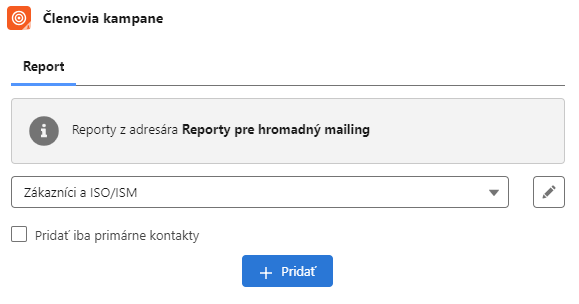

# DEUS

DEUS ma zakupene licencie Professional Edition, na ktorej sa neda deploynut kod pomocou sf cli, cize vsetky custom kodove riesenia musia byt nasadene pomocou managed package. Ten sa da vytvorit v orgu s Developer Edition licenciou.

# Komponenty

## PrxCampaignMembersFromReport
Komponent sluzi na pridanie clenov kampane z reportu. Reporty z ktorych je mozne pridavat clenov kampane musia byt umiestnene v adresary s DeveloperName = "ReportsForCampaigns" a musia obsahovat stlpec s api name ACCOUNT.NAME

